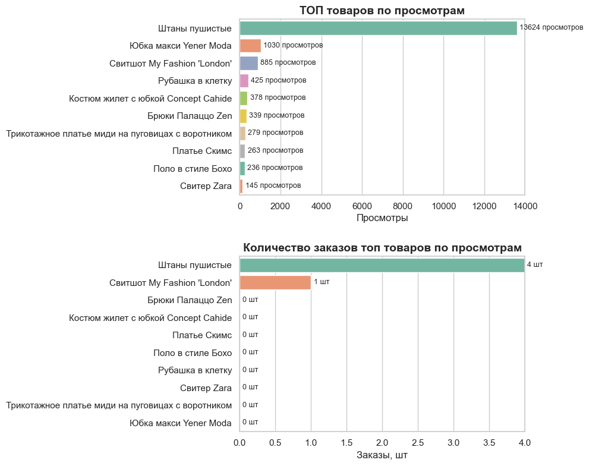
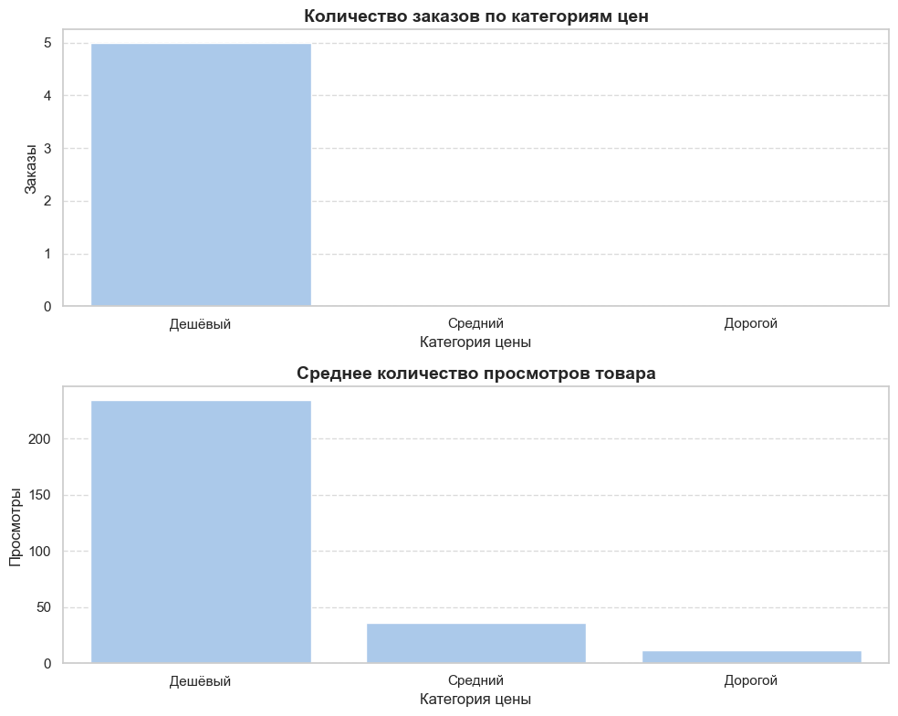
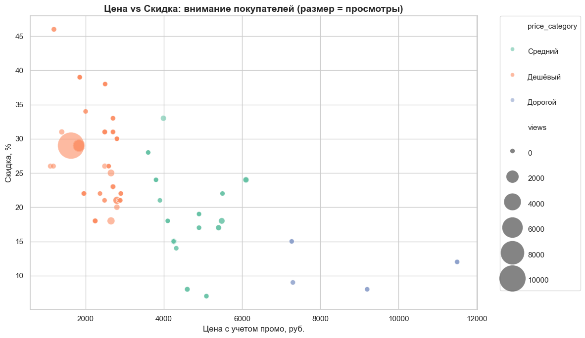
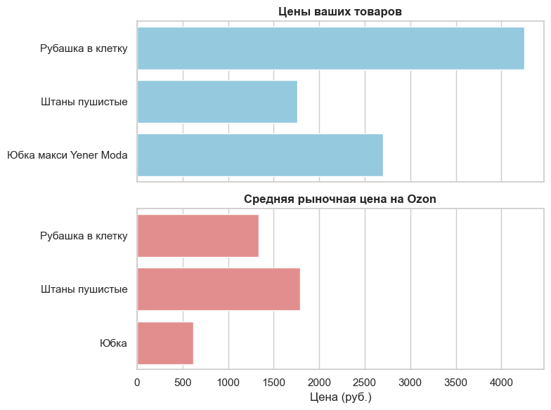

# Введение
Данный отчет подготовлен на основе анализа данных интернет-магазина одежды The Loom. Цель исследования — выявить, какие категории и товары привлекают наибольшее внимание покупателей, как соотносятся просмотры и заказы, а также насколько цены магазина конкурентоспособны на рынке.
Для обработки и визуализации данных применялся язык программирования Python с использованием библиотек для анализа и построения графиков. Полученные визуализации позволяют оценить текущую ситуацию по ассортименту, ценам и спросу, а также сформулировать рекомендации по улучшению продаж.

# Вопросы исследования
В ходе анализа интернет-магазина The Loom были поставлены следующие 4 вопроса:
1.	Какие товары входят в топ по просмотрам, и какие из них реально конвертируются в заказы?
2.	Как распределяются заказы и просмотры по ценовым категориям (дешёвый, средний, дорогой сегменты)?
3.	Как влияют цена и скидка на внимание покупателей (просмотры)?
4.	Насколько цены магазина соответствуют среднерыночным на Ozon?

# Анализ
Каждый график в данном проекте был построен для того, чтобы исследовать отдельный аспект работы интернет-магазина The Loom. Ниже представлены основные результаты анализа и рекомендации.

### 1.Какие товары входят в топ по просмотрам, и какие из них реально конвертируются в заказы?

  

Что показывает график:
- Верхняя диаграмма отражает топ товаров по просмотрам. Лидером с огромным отрывом стали «Штаны пушистые» (13 624 просмотра), далее идут «Юбка макси Yener Moda» (1030) и «Свитшот My Fashion 'London'» (885). Остальные товары имеют значительно меньшие значения.
- Нижняя диаграмма демонстрирует реальные заказы по этим же товарам. Здесь «Штаны пушистые» снова лидируют (4 заказа), но при этом видно, что у всех товаров крайне низкая конверсия. 

Ключевые инсайты:
1.	Критически низкая конверсия лидера.
«Штаны пушистые» генерируют огромный интерес, но почти не покупаются. Это указывает на проблемы с ценой, качеством карточки товара или доверием к бренду.
2.	Большинство топовых товаров не конвертируются.
Даже товары с сотнями–тысячами просмотров не дают заказов. Это снижает общую эффективность ассортимента.
3.	Разрыв «интерес → покупка» системный.
Такая ситуация характерна не только для одного товара, а для всего каталога: покупатели смотрят, но не решаются оформить заказ.

Рекомендации:
1.	Пересмотреть стратегию по «Штанам пушистым»:
o	Сравнить цену с рынком (вероятно, завышена).
o	Улучшить карточку товара: фото, описание, размеры, наличие отзывов.
o	Проверить логистику (стоимость/сроки доставки могли отпугивать).
2.	Увеличить доверие покупателей:
o	Стимулировать отзывы (например, бонусы за отзыв).
o	Использовать социальные доказательства: фото клиентов, отметку «бестселлер».
3.	Следить за конверсией.
o	Ввести отдельный KPI по конверсии в заказы для каждого товара.
o	Исключать или заменять товары, у которых есть просмотры, но стабильно нет продаж.

### 2.Как распределяются заказы и просмотры по ценовым категориям (дешёвый, средний, дорогой сегменты)?

  

Что показывает график:
- Верхняя диаграмма отражает количество заказов по ценовым категориям. Все заказы приходятся исключительно на дешёвый сегмент (5 заказов), в то время как средний и дорогой сегменты не дали ни одной продажи.
- Нижняя диаграмма показывает среднее количество просмотров одного товара в каждой ценовой категории. У дешёвых товаров этот показатель значительно выше (около 230 просмотров на товар), чем у среднего (~30) и дорогого сегментов (~10).

Ключевые инсайты:
1.	Фокус интереса на дешёвом сегменте.
Большинство клиентов интересуются именно дешёвыми товарами, и только они приносят реальные продажи.
2.	Средний и дорогой сегменты не востребованы.
Несмотря на наличие некоторого количества просмотров, заказы по этим категориям отсутствуют полностью.

Рекомендации:
1.	Развивать дешёвый сегмент.
Расширить ассортимент дешёвых товаров, так как именно они формируют основную выручку.
o	Поддерживать акции и промо именно в этой категории.
2.	Переработать стратегию для среднего сегмента.
Проверить цены относительно конкурентов.
Добавить скидки/бандлы, чтобы товары выглядели более доступными.
Улучшить описание и визуальное оформление карточек.
3.	Перепозиционировать дорогой сегмент.
Если цель — продавать премиум, необходимо подчеркнуть уникальность: качество, бренд, ограниченность.
Если стратегически премиум не нужен — стоит временно исключить дорогие товары, чтобы сосредоточить ресурсы на дешёвом и среднем сегменте.

### 3.Как влияют цена и скидка на внимание покупателей (просмотры)?
 
Что показывает график:
- По оси X указана цена товара с учётом промо, по оси Y — размер скидки (%).
- Размер кружков показывает количество просмотров, а цвет отражает ценовую категорию (дешёвый, средний, дорогой сегмент).
- Наибольшие кластеры просмотров сосредоточены в дешёвом сегменте (1–3 тыс. руб.) при скидках около 20–30%.
- Средний сегмент (3–7 тыс. руб.) получает меньше просмотров, даже при наличии скидок.
- Дорогие товары (выше 7 тыс. руб.) практически не привлекают внимания: просмотры единичные и без конверсии.

Ключевые инсайты:
1.	Максимальное внимание на дешёвых товарах со скидкой.
Покупатели активно реагируют на промо в пределах 20–30%. Это оптимальная зона, которая сочетает цену и стимул к покупке.
2.	Слабый интерес к среднему сегменту.
Даже при скидках внимание покупателей остаётся значительно ниже, чем у дешёвых товаров.
3.	Дорогие товары не воспринимаются как релевантные.
Скидки в премиум-сегменте (10–15%) не дают эффекта — спроса нет.

Рекомендации:
1.	Усилить стратегию скидок в дешёвом сегменте.
Поддерживать скидки в диапазоне 20–30%.
Продвигать самые просматриваемые товары как «хиты продаж».
2.	Стимулировать средний сегмент.
Тестировать более агрессивные скидки (30–35%).
Подчеркнуть ценность: качество, материалы, брендовость.
3.	Перепозиционировать дорогой сегмент.
Если цель — продажи премиума, необходимо больше усилий в маркетинге: реклама, премиальный контент, коллаборации.
Если приоритет — массовый рынок, можно временно сократить количество дорогих позиций и сфокусироваться на бюджетных товарах.

### 4.Насколько цены магазина соответствуют среднерыночным на Ozon?

 

Что показывает график:

Для оценки конкурентоспособности цен я с помощью парсинга собрал данные с Ozon по аналогичным товарам конкурентов и сравнил их со стоимостью товаров магазина The Loom.
- Верхняя диаграмма показывает цены товаров магазина («Рубашка в клетку», «Штаны пушистые», «Юбка макси Yener Moda»).
- Нижняя диаграмма отражает средние рыночные цены на аналогичные позиции на Ozon.

Ключевые инсайты:
1.	Завышенные цены по ряду товаров.
«Рубашка в клетку» и «Юбка макси Yener Moda» стоят у магазина заметно дороже рынка (разница превышает 1000–1500 рублей).
2.	Ценовое позиционирование магазина смещено вверх.
В целом товары стоят дороже рынка, что снижает их шансы на покупку при равных условиях (особенно учитывая низкую конверсию).

Рекомендации:
1.	Скорректировать цены на позиции с сильным завышением.
Некоторые товары требуют пересмотра стоимости, чтобы приблизиться к среднерыночным значениям.
Возможен вариант оставить цену выше, но тогда нужно усиливать ценность через маркетинг (бренд, качество, уникальность).
2.	Использовать конкурентные позиции для продвижения.
«Штаны пушистые», как товар с ценой в рынке и высоким интересом, можно сделать «локомотивом» продаж — продвигать их через акции, подборки и рекламу.
3.	Формировать гибкую стратегию ценообразования.
Регулярно отслеживать цены конкурентов с помощью парсинга.
Вводить динамическое ценообразование для ключевых категорий.

### Заключение

Проведённый анализ интернет-магазина The Loom показал, что текущая стратегия продаж и ценообразования требует пересмотра. Основной интерес покупателей сосредоточен на дешёвом сегменте товаров, именно он приносит единственные заказы. Средний и дорогой сегменты практически не востребованы, что говорит о слабом позиционировании и низкой привлекательности этих категорий.

Несмотря на высокий интерес к отдельным позициям (например, «Штаны пушистые»), конверсия в покупки остаётся крайне низкой. Это указывает на барьеры для клиентов: завышенные цены по части товаров, недостаточно проработанные карточки, слабая работа с доверием (отзывы, социальные доказательства).

Сравнение с Ozon подтверждает: часть товаров магазина стоит значительно дороже рыночных аналогов, что дополнительно снижает конкурентоспособность.

Для увеличения продаж магазину рекомендуется:
- развивать и расширять линейку дешёвого сегмента,
- оптимизировать цены с учётом рынка,
- усилить карточки товаров и работу с отзывами,
- пересмотреть стратегию среднего и дорогого сегментов (либо перепозиционировать, либо временно сократить).

Магазин имеет потенциал для роста, но для повышения эффективности необходимо сместить акцент на потребности аудитории и устранить разрыв между интересом покупателей и их реальными покупками.

